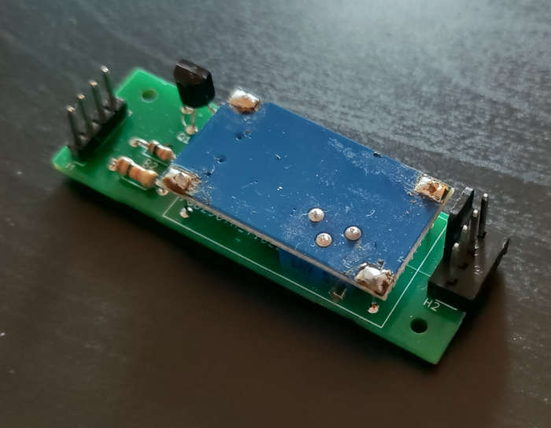

# fan-4-pi
12V PWM fan for Raspberry Pi

# Problem
Raspberry Pi usually needs cooling fan.
In most cases you may want to use small 5V fan.
I have bought 3 different 5V fans and all of them are too noisy.
On the opposite side it is very easy to buy
regular 12V cooling PWM fan 80x80mm.
So, this project is about using 12V PWM fan for Raspberry Pi.

# Overview 
This project consists of 2 parts
- [software](software)
- [hardware](hardware)

# Software
Software is represented as python script.
It is considered that python [script](software/fan_ctrl/fan_ctrl.py) will be installed
as system [service](software/fan_ctrl/fanctrl.service).
You can [install](software/fan_ctrl/install-service.sh) and [uninstall](software/fan_ctrl/uninstall-service.sh)
the service via shell-scripts.
You may want to tune config file [config.conf](software/fan_ctrl/config.conf).
It contains comments about properties, so it is easy to make it fit to your system.
You can edit it after installation, it lives here `/etc/fan-pwm-control/config.conf`.
After you edit your config file you need to apply it:
```shell
systemctl restart fanctrl.service
```
Do not forget to check your service health
```shell
systemctl status fanctrl.service
```
Also, you can use [print-t.sh](software/fan_ctrl/print-t.sh) and
[print-t-repeat.sh](software/fan_ctrl/print-t-repeat.sh) scripts to know current CPU temperature.

# Hardware
Hardware is just possible electric schemas for connecting your 12V PWM fan to Raspberry Pi.
You can choose any of variants.

## Schema with external power supply (Case A)

### Electric schema


## Schema with internal power supply (Case B)

### Electric schema


### Real device
